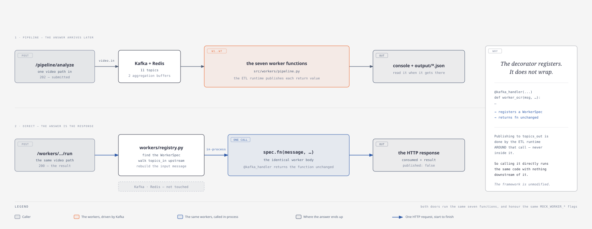

# Video analysis pipeline — documentation

A 7-worker [QF framework](../app/dist/) pipeline that takes **one video path** and
returns **one enriched JSON record**: who is in it, what happens in it, what is
written on screen, what is said — and a summary, an entity list and a sentiment
label derived from all of that.

| | |
|---|---|
| Code | [`../app/`](../app/) |
| Start it | `cd ../app && docker compose up -d --build` |
| Run the pipeline | <http://localhost:5000> → `POST /pipeline/analyze` |
| Run one worker | <http://localhost:5000> → `POST /workers/{worker}/run` |
| Results | `../app/output/<video name>_analysis.json` |

---

## The four diagrams

### 1 · Worker topology

Seven workers, eleven Kafka topics, two Redis-backed aggregation points — and
the one branch that bypasses the first of them.

### 2 · Message shape

How three service answers become one `video_description` string, where the
fourth goes instead, and what the record that comes out looks like.

### 3 · Deployment

What `docker compose` starts — and the five AI services, which it does not.

### 4 · Two front doors

The same seven workers, reached two ways: through Kafka, or one at a time
straight from Swagger.

---

## Documents

| File | What is in it |
|---|---|
| [`architecture.md`](architecture.md) | The full reference: every worker, every topic, every message shape, the AI contracts, configuration, mocking, failure behaviour and how to extend it |
| [`call_ai_individually.md`](call_ai_individually.md) | Calling one AI service on its own from Swagger — a request and a response for every worker, with nothing published to Kafka |
| [`../app/README.md`](../app/README.md) | Quick start, API, configuration table, layout |
| `diagrams-src/*.html` | Editable source for each diagram — open in a browser, edit, re-export |

Each `diagram-N-*.svg` is generated from the matching `diagrams-src/diagram-N-*.svgbody`
fragment; the `.html` file is the same diagram wrapped in a titled page.
