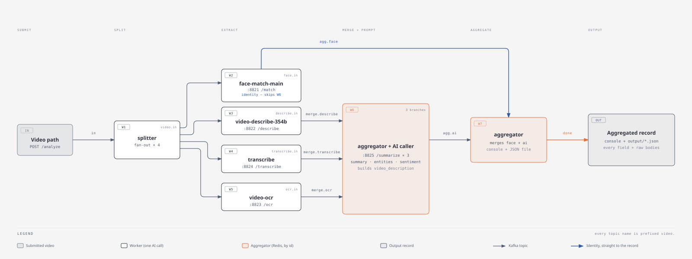
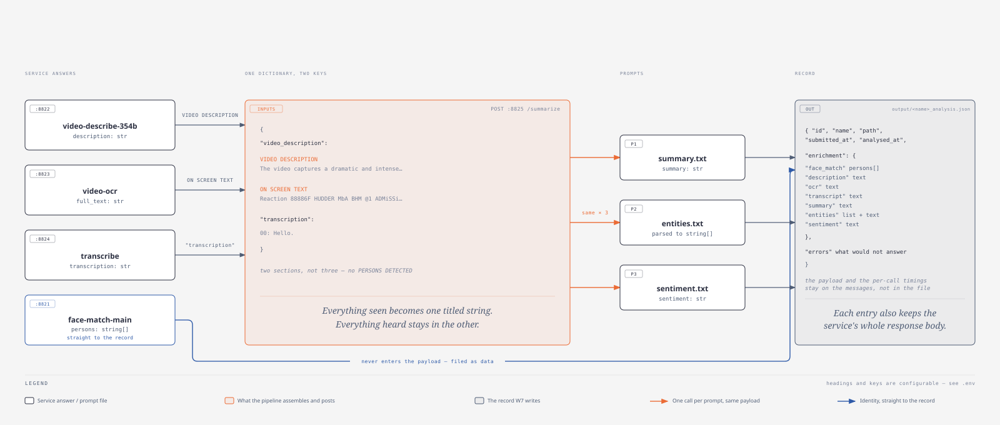
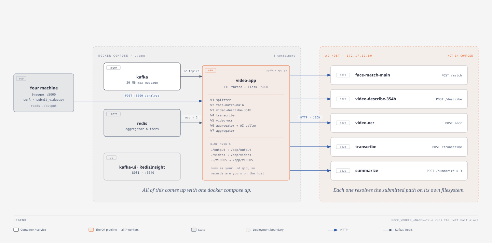

# Video analysis pipeline — architecture

One video path in, one enriched JSON record out.

The pipeline is seven [QF framework](../app/dist/) workers wired by eleven Kafka
topics. Four of them each call one AI service in parallel; a fifth merges three
of those answers and prompts a summary service three times; the last one joins
that with the fourth, assembles a single record, prints it and writes it to disk.

Any one of those workers can also be run on its own, synchronously, from the
Swagger UI — see [`call_ai_individually.md`](call_ai_individually.md).

**The five AI services are not part of this project.** They run on their own
host (`172.17.12.80`, ports 8821–8825 by default) and are reached over plain
HTTP. `docker compose` starts Kafka, Redis, their two web UIs and the pipeline —
nothing else. Every AI call can be mocked independently, so the whole topology
runs end to end with no access to that host.

---

## Contents

1. [The workers](#the-workers)
2. [Two front doors](#two-front-doors)
3. [Topics](#topics)
4. [Message shapes](#message-shapes)
5. [The `video_description` string](#the-video_description-string)
6. [The output record](#the-output-record)
7. [The AI service contracts](#the-ai-service-contracts)
8. [Mocking](#mocking)
9. [Failure behaviour](#failure-behaviour)
10. [Logging](#logging)
11. [Configuration](#configuration)
12. [Running it](#running-it)
13. [Extending it](#extending-it)
14. [Known constraints](#known-constraints)

---

## The workers



| # | Worker | Kind | Consumes | Produces | Job |
|---|--------|------|----------|----------|-----|
| 1 | `splitter` | handler | `video.in` | `video.face.in`, `video.describe.in`, `video.transcribe.in`, `video.ocr.in` | one submitted path → four parallel extraction branches |
| 2 | `face-match-main` | handler | `video.face.in` | `video.agg.face` | `POST :8821/match` — who appears in the video |
| 3 | `video-describe-354b` | handler | `video.describe.in` | `video.merge.describe` | `POST :8822/describe` — what happens, in prose |
| 4 | `transcribe` | handler | `video.transcribe.in` | `video.merge.transcribe` | `POST :8824/transcribe` — the audio as text |
| 5 | `video-ocr` | handler | `video.ocr.in` | `video.merge.ocr` | `POST :8823/ocr` — text burnt into the frames |
| 6 | `aggregator-ai-caller` | **aggregator** | the three `video.merge.*` | `video.agg.ai` | merge 3 branches, build the payload, `POST :8825/summarize` **× 3** |
| 7 | `aggregator` | **aggregator** | `video.agg.face` + `video.agg.ai` | `video.done` | assemble the record, print it, write it |

Everything lives in [`app/src/workers/pipeline.py`](../app/src/workers/pipeline.py)
— that file holds **only** the seven decorated functions. Every helper they call
is in `utils.py` (logging, timing, the resilient AI call, path handling, string
assembly, the record, rendering), `ai_client.py` (the only module that talks to a
service) and `record_writer.py` (the file sink).

### Why face matching skips W6

The four extraction branches part ways after W1, because they answer two
different kinds of question:

- **W3, W4 and W5 produce content** — prose, speech and on-screen text. Those
  are things to paraphrase, so they meet in W6 and become the payload the
  summary prompts read.
- **W2 produces identity** — *who* is in the video. That is structured data for
  the record, not prose for a model. Feeding a list of person ids into a summary
  prompt adds nothing the record does not already carry, and it lets one
  branch's latency delay all three prompts.

So `face-match-main` publishes to `video.agg.face` only, and W7 files its answer
under `enrichment.face_match`. Two practical consequences:

- `video_description` has **two** sections, not three — there is no
  `PERSONS DETECTED` heading and no `SECTION_PERSONS` setting.
- W6 fires as soon as three branches have arrived, so a slow or dead face-match
  service no longer holds up the summary, the entities or the sentiment.

### Why there are two aggregators

Both are `@kafka_aggregator(aggregate_by="id")`. The framework buffers each
arriving branch in Redis under `agg:<worker>:<message id>` and only invokes the
worker body once **every** input topic has delivered — 3 branches for W6, 2 for
W7. The merge itself (`deep_merge`) is done by the runtime, not by the worker.

This is why the message `id` must be unique per submission: it is the
aggregation key for both stages.

---

## Two front doors

The same seven workers are reachable two ways.

| | `POST /pipeline/analyze` | `POST /workers/{worker}/run` |
|---|---|---|
| What happens | the path is published to `video.in`; the pipeline runs across Kafka | one worker runs inside the HTTP request |
| The answer | later — console + `output/*.json` | immediately, in the response body |
| Kafka / Redis | every topic, both aggregations | **neither is touched** |
| For | the real thing | trying one service, debugging a prompt, checking a payload |

The second one works because `@kafka_handler` does not wrap the function it
decorates: it registers a `WorkerSpec` holding a reference to it and returns the
function unchanged, and the ETL publishes the return value *around* that call.
So `spec.fn(message, consumer_name, metadatas)` runs the identical worker body
with nothing downstream of it. `app/src/workers/registry.py` does exactly that,
and rebuilds the input message by walking the same topic graph — calling
`aggregator` therefore runs the whole pipeline synchronously.

Full reference, with a request and a response for every worker:
[`call_ai_individually.md`](call_ai_individually.md).

---

## Topics

All eleven are prefixed `video.`:

```
video.in                 W1 in    the submitted path lands here
video.face.in            W1 → W2
video.describe.in        W1 → W3
video.transcribe.in      W1 → W4
video.ocr.in             W1 → W5
video.agg.face           W2 → W7    identity, straight to the record
video.merge.describe     W3 → W6
video.merge.transcribe   W4 → W6
video.merge.ocr          W5 → W6
video.agg.ai             W6 → W7
video.done               W7 →       terminal per-video event (carries the record)
video.dlq                           errors, when AI_FAIL_FAST=true
```

Defined once in [`app/src/config.py`](../app/src/config.py) as `Topics`, and
served live at `GET /pipeline/config`.

The framework allows **one worker per topic**; `tests/test_workers.py` asserts
that the wiring above holds.

---

## Message shapes



### What you submit

```json
{ "path": "/video/migrants.mp4" }
```

Optionally `id`, `name`, and `options` (forwarded to the transcribe service):

```json
{
  "id": "vid-demo-1",
  "path": "/video/migrants.mp4",
  "name": "migrants.mp4",
  "options": { "language": "ro", "task": "transcribe" }
}
```

### What W1 puts on the four branch topics

The same dict to all four — only the path travels, never the video:

```json
{
  "id": "vid-demo-1",
  "path": "/video/migrants.mp4",
  "name": "migrants.mp4",
  "options": {},
  "submitted_at": "2026-09-16T12:04:19+00:00"
}
```

### What each extraction worker adds

Every branch echoes the identity fields (so the aggregators can regroup them)
and adds one key of its own:

| Worker | Key | Contents |
|---|---|---|
| W2 | `face` | `persons[]`, `message`, `source`, `raw` |
| W3 | `describe` | `description`, `metadata`, `source`, `raw` |
| W4 | `transcribe` | `transcription`, `format`, `metadata`, `source`, `raw` |
| W5 | `ocr` | `full_text`, `frames_count`, `metadata`, `source`, `raw` |

`source` records *how* the answer was produced — `{service, mocked, endpoint,
duration_ms}`, plus `error` when the service would not answer. `raw` is the
service's complete response body, carried forward so the final record can hold
it.

> W5 drops the per-frame `frames` array before republishing. It is the bulkiest
> thing in the pipeline, nothing downstream reads it, and it would otherwise
> ride through Kafka twice. `OCR_KEEP_FRAMES=true` keeps it.

---

## The `video_description` string

This is the heart of the pipeline. W6 folds **what is visible** into one titled
string and leaves **what is audible** in another:

```json
{
  "inputs": {
    "video_description": "VIDEO DESCRIPTION\n<what :8822 described>\n\nON SCREEN TEXT\n<what :8823 read>",
    "transcription": "<what :8824 heard>"
  },
  "prompt": "summary.txt",
  "options": { "num_predict": 2048 }
}
```

Rendered, it looks like this:

```
VIDEO DESCRIPTION
The video captures a dramatic and intense scene of migrants from Morocco
attempting to cross the border into Spain's Ceuta. …

ON SCREEN TEXT
Reaction
88886F
HUDDER
…
```

Rules:

- The two sections always appear in that order.
- A section whose worker returned nothing still appears, with
  `SECTION_EMPTY_PLACEHOLDER` (`(none)`) under it — so the model is told the
  difference between "nothing was found" and "this was not checked". Set the
  placeholder to an empty string to drop the section instead.
- The identified persons are **not** here — face matching goes straight to the
  record (see [Why face matching skips W6](#why-face-matching-skips-w6)).
- Both headings, both key names and the placeholder are `.env` settings
  (`SECTION_DESCRIPTION`, `SECTION_OCR`, `SUMMARIZE_KEY_DESCRIPTION`,
  `SUMMARIZE_KEY_TRANSCRIPT`).

Built by `utils.build_inputs()` / `utils.build_video_description()`.

### Three prompts, one payload

W6 posts that identical dict to `:8825/summarize` three times, changing only the
`prompt` file:

| Call | Prompt | Read back as |
|---|---|---|
| summary | `summary.txt` | `enrichment.summary.text` |
| entities | `entities.txt` | `enrichment.entities.list` (parsed) + `.text` (raw) |
| sentiment | `sentiment.txt` | `enrichment.sentiment.text` |

The service answers with the same `{"summary": …, "metadata": …}` envelope every
time — the prompt decides what the text *means*. The entities answer is text, so
`utils.parse_entities()` normalises it to a list, handling a JSON array (fenced
or not), a comma-separated line and a bulleted list. **The raw answer is always
kept**, so a bad parse loses nothing.

---

## The output record

W7 writes one file per video:

```
<OUTPUT_DIR>/<video name without extension><OUTPUT_FILE_SUFFIX>
/video/migrants.mp4  ->  output/migrants_analysis.json
```

`OUTPUT_DIR` is `/app/output` in the container, bind-mounted to `./output` on
the host, and the container runs as your uid — so records show up under
`app/output/` owned by you, as they are produced. The path is echoed on the
submit response and on the terminal `video.done` event as `output_file`.

Everything the AI services produced lives under **`enrichment`**, one entry per
call:

```json
{
  "id": "vid-demo-1",
  "name": "migrants.mp4",
  "path": "/video/migrants.mp4",
  "submitted_at": "2026-09-16T12:04:19+00:00",
  "analysed_at": "2026-09-16T12:04:46+00:00",

  "enrichment": {
    "face_match":  { "persons": ["222"], "message": "The following persons identified in this video", "response": { } },
    "description": { "text": "The video captures a dramatic…", "metadata": { "model": "Qwen/Qwen3.5-4B", "frames_sampled": 31 }, "response": { } },
    "transcript":  { "text": "00: Hello.\n", "format": "dialog", "metadata": { "model": "large-v3", "total_speakers": 2 }, "response": { } },
    "ocr":         { "text": "Reaction\n88886F\n…", "frames_count": 9, "metadata": { "model": "easyocr:en" }, "response": { } },
    "summary":     { "text": "Migrants are filmed crossing…", "prompt": "summary.txt", "metadata": { }, "response": { } },
    "entities":    { "list": ["Morocco", "Spain", "Ceuta"], "text": "[\"Morocco\", \"Spain\", \"Ceuta\"]", "prompt": "entities.txt", "metadata": { }, "response": { } },
    "sentiment":   { "text": "negative", "prompt": "sentiment.txt", "metadata": { }, "response": { } }
  },

  "errors": { }
}
```

| Block | What it is for |
|---|---|
| `enrichment.*.text` / `.list` / `.persons` | the parsed value — what you normally read |
| `enrichment.*.metadata` | the service's own metadata (model, device, timings) |
| `enrichment.*.response` | the service's **complete** response body, verbatim — set `OUTPUT_INCLUDE_RAW=false` to drop it |
| `errors` | only the services that would not answer; `{}` on a clean run |

That is the whole record: the identity of the run, what the services answered,
and what failed. Two things deliberately stay **out** of it:

- **`inputs`** — the exact payload posted to `:8825`. It still rides on W6's
  message, so `POST /workers/aggregator-ai-caller/run` and kafka-ui both show
  it; it is just not duplicated into every record on disk.
- **`calls`** — the per-service provenance (mocked or live, which URL, how
  long). Same story: it travels on the branch messages, and the `[ai]` log lines
  carry the timings. Each `enrichment` entry still has the service's own
  `metadata`.

The file is written atomically (a `.tmp` beside it, then renamed), so a reader
never sees half a record. `OUTPUT_WRITE_FILE=false` leaves the console as the
only output; `OUTPUT_UNIQUE_NAMES=true` appends the message id to the file name
so re-running a video keeps both.

### The console

W7 also prints the record (`OUTPUT_FORMAT=block|line|json`):

```
──────────────────────────────────────────────────────────────────────────────
 VIDEO       : migrants.mp4  (/video/migrants.mp4)
 id          : vid-demo-1
 analysed_at : 2026-09-16T12:04:46+00:00
──────────────────────────────────────────────────────────────────────────────
 PERSONS     : 222
 DESCRIPTION : The video captures a dramatic and intense scene of migrants…
 ON SCREEN   : Reaction 88886F HUDDER MbA BHM @1 ADMiSSiOMS C OPENFor I n…
 TRANSCRIPT  : 00: Hello.
──────────────────────────────────────────────────────────────────────────────
 SUMMARY     : Migrants are filmed crossing from Morocco into Ceuta by sea…
 ENTITIES    : Morocco, Spain, Ceuta, Red Cross, Huddersfield
 SENTIMENT   : negative
──────────────────────────────────────────────────────────────────────────────
```

Per-call timings and which services were mocked are in the `[ai]` log lines
above it, not in the record.

---

## The AI service contracts

Every call is made by [`app/src/ai_client.py`](../app/src/ai_client.py) — one
function per service, and the only module in the project that opens a socket to
the AI host.

### `:8821` face-match-main — `POST /match`

```jsonc
// request
{ "path": "/video/1.mp4" }
// response
{ "message": "The following persons identified in this video", "persons": ["222"] }
```

### `:8822` video-describe-354b — `POST /describe`

```jsonc
// request
{ "path": "/video/migrants.mp4" }
// response
{ "description": "The video captures…", "metadata": { "model": "Qwen/Qwen3.5-4B", "fps": 0.5, "frames_sampled": 31, "processing_time_seconds": 26.429 } }
```

### `:8823` video-ocr — `POST /ocr`

```jsonc
// request
{ "path": "/video/sna.mp4" }
// response
{ "frames": [ { "frame_index": 0, "timestamp_ms": 0.0, "text": "Reaction\n88886F…" } ],
  "full_text": "Reaction\n88886F\n…",
  "metadata": { "model": "easyocr:en", "fps": 1.0, "frames_sampled": 9 } }
```

### `:8824` transcribe — `POST /transcribe`

```jsonc
// request — everything but `path` comes from .env, overridable per submit
{ "path": "/audio/input.mp4", "language": "ar", "task": "translate",
  "format": "dialog", "transcription_level": "word", "dialog_timestamps": false }
// response
{ "format": "dialog", "transcription": "00: Hello.\n",
  "metadata": { "model": "large-v3", "total_speakers": 2, "detected_language": "ar", "output_language": "en" } }
```

### `:8825` summarize — `POST /summarize` (three times)

```jsonc
// request
{ "inputs": { "video_description": "VIDEO DESCRIPTION\n…", "transcription": "00: Hello." },
  "prompt": "summary.txt",
  "options": { "num_predict": 2048 } }
// response — the same envelope for every prompt
{ "summary": "…", "metadata": { "prompt": "summary.txt", "provider": "ollama", "model": "phi4:14b-q8_0", "input_tokens": 1200, "duration_seconds": 3.127 } }
```

### Transport

- Timeout `AI_TIMEOUT_SEC` (600 s — a cold model on a long video).
- `AI_RETRIES` transport-level retries with linear backoff, for connection
  errors and **5xx** only. A **4xx** is a bad request on our side and fails
  immediately.
- A non-JSON body, a non-object body or an exhausted retry budget raises
  `AIServiceError`.

---

## Mocking

Each of the seven AI calls has its own switch in `.env`:

```bash
MOCK_WORKER_FACE_MATCH=True
MOCK_WORKER_DESCRIBE=True
MOCK_WORKER_OCR=True
MOCK_WORKER_TRANSCRIBE=True
MOCK_WORKER_SUMMARY=True
MOCK_WORKER_ENTITIES=True
MOCK_WORKER_SENTIMENT=True
```

`True` makes that worker return the canned body from
[`app/src/mock/mock_responses.py`](../app/src/mock/mock_responses.py) without
opening a socket. **The topics, the message shapes and the code path are
identical either way** — a fully mocked run exercises the entire pipeline,
including both Redis aggregations, with no access to `172.17.12.80`.

The canned bodies are verbatim captures of the documented responses. Editing
them is the supported way to try a different downstream shape without touching
the AI host. `MOCK_LATENCY_MS` adds fake per-call latency if you want the
fan-out to be visible in the logs.

Mocking is per worker, so mixing is fine: mock the slow describe service and
call the rest for real.

The flag is checked inside `ai_client`, *below* the worker, so it applies just
as much when a worker is called directly from Swagger — which is what makes
`POST /workers/{worker}/run` usable with the AI host out of reach.

`GET /pipeline/health` lists `workers_mocked` and `workers_live`;
`GET /workers/list` shows the same flags per AI call.

---

## Failure behaviour

A fan-in is only as available as its slowest branch. If an extraction worker
raised on a dead service, its branch would never arrive, its aggregator would
never fire, and the video would sit in Redis until `AGGREGATOR_TIMEOUT_SEC`
expired — no record, no error in the output, nothing to look at but the DLQ.

So by default (`AI_FAIL_FAST=false`) a failing AI call is **recorded on its
branch and published anyway**:

- the branch carries its normal shape with empty content and
  `source.error` set;
- W6 still builds the payload — a missing section shows `(none)`;
- W7 still writes a record, and `errors` names what broke;
- the `video.done` event carries `failed_services`.

Because face matching no longer feeds W6, a dead `:8821` now costs only the
`persons` field: the summary, the entities and the sentiment are produced from
the three content branches as usual.

A worker called directly through `POST /workers/{worker}/run` behaves the same
way — the failure comes back as `200` with `source.error` set, not as a 502,
unless `AI_FAIL_FAST=true`.

```jsonc
"errors": {
  "face-match-main": "face-match-main at http://172.17.12.80:8821/match rejected the request (400): '{\"detail\":\"path /video/migrants.mp4 does not exist\"}'"
}
```

Set `AI_FAIL_FAST=true` to restore strict behaviour: the worker re-raises and
the framework's retry/DLQ policy owns it, so no partial record is ever produced.

---

## Logging

Every worker logs what it received, every call it made and what came back, with
timings. One submission looks like this:

```
[W1 splitter]           id=demo-1 START submitted='/video/migrants.mp4'
[W1 splitter]           id=demo-1 DONE  name='migrants.mp4' -> video.face.in / … in 0.4ms
[W2 face-match-main]    id=demo-1 START path='/video/migrants.mp4'
[ai] id=demo-1 face-match-main      --> POST http://172.17.12.80:8821/match {"path": "/video/migrants.mp4"}
[ai] id=demo-1 face-match-main      <-- 200 in 1843.2ms {"message": "The following persons…", "persons": ["222"]}
[W2 face-match-main]    id=demo-1 DONE  persons=1 ['222'] in 1844.0ms
…
[W6 aggregator-ai-caller] id=demo-1 START 3 branches merged — description=1308 ocr=742 transcript=11
[W6 aggregator-ai-caller] id=demo-1 inputs built: video_description=2085 chars (VIDEO DESCRIPTION + ON SCREEN TEXT), transcription=10 chars
[ai] id=demo-1 summarize:summary    --> POST http://172.17.12.80:8825/summarize {"inputs": {…}, "prompt": "summary.txt", …}
[ai] id=demo-1 summarize:summary    <-- 200 in 3127.0ms {"summary": "Migrants are filmed crossing…", …}
[W6 aggregator-ai-caller] id=demo-1 DONE  3 prompts answered — summary=258 chars, entities=5, sentiment='negative' in 9.4s
[W7 aggregator]         id=demo-1 START 2 branches merged (face + ai)
[sink] id=demo-1 wrote record -> /app/output/migrants_analysis.json
[W7 aggregator]         id=demo-1 DONE  persons=1 entities=5 sentiment='negative' failed=none written=… in 0.9ms
```

- Request and response bodies are truncated to `AI_LOG_BODY_CHARS` (400);
  `AI_LOG_BODIES=False` keeps the timings and drops the payloads.
- A failure logs at ERROR with the elapsed time and the service's own message.
- `LOGGING_LEVEL=DEBUG` adds the framework's per-message dispatch traces.

```bash
docker compose logs -f app
```

---

## Configuration

Everything is env-driven — [`app/.env`](../app/.env), read by
[`app/src/config.py`](../app/src/config.py) and passed to the container through
`env_file`. `GET /pipeline/config` serves the resolved values.

### AI services

| Var | Default | Meaning |
|---|---|---|
| `AI_FACE_MATCH_URL` | `http://172.17.12.80:8821` | origin; the path (`/match`) is appended |
| `AI_DESCRIBE_URL` | `…:8822` | |
| `AI_OCR_URL` | `…:8823` | |
| `AI_TRANSCRIBE_URL` | `…:8824` | |
| `AI_SUMMARIZE_URL` | `…:8825` | |
| `AI_TIMEOUT_SEC` | `600` | per call |
| `AI_RETRIES` | `2` | transport-level, 5xx and connection errors only |
| `AI_RETRY_BACKOFF_SEC` | `2.0` | linear |
| `AI_FAIL_FAST` | `False` | `True` = re-raise instead of recording the error |
| `AI_LOG_BODIES` | `True` | log request/response bodies |
| `AI_LOG_BODY_CHARS` | `400` | truncation limit |
| `MOCK_WORKER_*` | — | seven switches, see [Mocking](#mocking) |
| `MOCK_LATENCY_MS` | `0` | fake latency for a mocked call |

### The payload

| Var | Default | Meaning |
|---|---|---|
| `SUMMARIZE_KEY_DESCRIPTION` | `video_description` | the key everything visible goes under |
| `SUMMARIZE_KEY_TRANSCRIPT` | `transcription` | the key the audio goes under |
| `SECTION_DESCRIPTION` | `VIDEO DESCRIPTION` | first heading |
| `SECTION_OCR` | `ON SCREEN TEXT` | second heading |
| `SECTION_EMPTY_PLACEHOLDER` | `(none)` | shown under a heading with nothing; empty = drop the section |
| `SUMMARY_PROMPT` | `summary.txt` | |
| `ENTITIES_PROMPT` | `entities.txt` | |
| `SENTIMENT_PROMPT` | `sentiment.txt` | |
| `SUMMARIZE_NUM_PREDICT` | `2048` | passed through as `options.num_predict` |

### Transcription

| Var | Default |
|---|---|
| `TRANSCRIBE_LANGUAGE` | `ar` |
| `TRANSCRIBE_TASK` | `translate` |
| `TRANSCRIBE_FORMAT` | `dialog` |
| `TRANSCRIBE_LEVEL` | `word` |
| `TRANSCRIBE_DIALOG_TIMESTAMPS` | `False` |

All five are overridable per submission through `options`.

### Output

| Var | Default | Meaning |
|---|---|---|
| `OUTPUT_FORMAT` | `block` | `block` \| `line` \| `json` |
| `OUTPUT_DIR` | `/app/output` | bind-mounted to `./output` |
| `OUTPUT_FILE_SUFFIX` | `_analysis.json` | |
| `OUTPUT_WRITE_FILE` | `True` | `False` = console only |
| `OUTPUT_INCLUDE_RAW` | `True` | keep each service's full `response` body |
| `OUTPUT_UNIQUE_NAMES` | `False` | append the id, so re-runs keep both files |
| `OUTPUT_JSON_INDENT` | `2` | |
| `OUTPUT_TEXT_PREVIEW_CHARS` | `400` | console truncation |
| `OCR_KEEP_FRAMES` | `False` | keep the per-frame OCR array in the message |

### Infrastructure

| Var | Default | Meaning |
|---|---|---|
| `KAFKA_BOOTSTRAP_SERVERS` | `localhost:9094` | `kafka:9092` inside compose |
| `KAFKA_MAX_MESSAGE_BYTES` | `20971520` | OCR and transcripts exceed Kafka's 1 MB default |
| `REDIS_HOST` / `REDIS_PORT` | `localhost` / `6379` | the aggregator buffers |
| `AGGREGATOR_TIMEOUT_SEC` | `3600` | how long a half-analysed video waits for its branches |
| `VIDEO_SEARCH_DIRS` | `videos/`, `VIDEOS/`, `data/` | where a submitted path is looked up locally |
| `VIDEO_PATH_PASSTHROUGH` | `True` | `False` = reject a path this container cannot see |
| `API_HOST` / `API_PORT` | `0.0.0.0` / `5000` | |
| `LOGGING_LEVEL` | `INFO` | |

---

## Running it



```bash
cd app
docker compose up -d --build
docker compose logs -f app          # this is where the analysis is printed
```

| Service | URL |
|---------|-----|
| Swagger — `pipeline` and `workers` namespaces | <http://localhost:5000> |
| kafka-ui — browse the eleven topics | <http://localhost:8081> |
| RedisInsight — watch the aggregator keys | <http://localhost:5540> |

Submit one video:

```bash
curl -X POST http://localhost:5000/pipeline/analyze \
     -H 'Content-Type: application/json' \
     -d '{"path": "/video/migrants.mp4"}'
```

```jsonc
// 202
{ "id": "vid-3f2a91c4e0b7", "topic": "video.in", "path": "/video/migrants.mp4",
  "name": "migrants.mp4", "output_file": "/app/output/migrants_analysis.json",
  "status": "submitted",
  "transcribe_params": { "language": "ar", "task": "translate", … },
  "mocked_workers": [ … ] }
```

### The API

| Method | Path | Body | Response |
|--------|------|------|----------|
| POST | `/pipeline/analyze` | `{"path"}` + optional `id`, `name`, `options` | `202 {id, topic, path, output_file, transcribe_params, mocked_workers}` |
| GET | `/pipeline/health` | — | `200 {status, kafka, input_topic, workers_mocked, workers_live}` |
| GET | `/pipeline/config` | — | `200 {ai_services, mocked, prompts, summarize_inputs, transcribe_defaults, output, topics}` |
| GET | `/workers/list` | — | `200 {workers: [{worker, step, kind, topics_in, topics_out, runs_first, mocked}], …}` |
| POST | `/workers/{worker}/run` | `{"path"}` + optional `id`, `name`, `options`, `chain`, `persist`, `message` | `200 {worker, kind, ran_first, would_publish_to, published: false, consumed, result}` |

The pipeline has no "get result" endpoint — its output is the console and the
record file, whose path the submit response already gives you. When you want the
answer *in* the response instead, call the worker directly:

```bash
# one service
curl -X POST http://localhost:5000/workers/video-ocr/run \
     -H 'Content-Type: application/json' \
     -d '{"path": "/video/migrants.mp4"}'

# the whole pipeline, synchronously, record included
curl -X POST http://localhost:5000/workers/aggregator/run \
     -H 'Content-Type: application/json' \
     -d '{"path": "/video/migrants.mp4"}'
```

Nothing is published to Kafka by either call. Full reference:
[`call_ai_individually.md`](call_ai_individually.md).

### From the command line

```bash
python tools/submit_video.py /video/migrants.mp4
python tools/submit_video.py /video/1.mp4 --id vid-demo-1
python tools/submit_video.py /audio/input.mp4 --language ro --task transcribe
```

### Locally, infra in Docker

```bash
docker compose up -d kafka kafka-ui redis redis-insight
python -m venv venv && source venv/bin/activate
pip install ./dist/qf-1.0.5-py3-none-any.whl -r requirements.txt
python app.py
```

Stop the `app` container first — both processes share the consumer group
`video-pipeline` and would split the partitions between them.

### Tests

```bash
pytest -m "not integration"   # 41 unit tests, no infra, no AI host
pytest -m integration         # needs kafka + redis; stop the app container first
tests/e2e/e2e_test.sh         # two phases: submit through the API and verify the
                              # record, then run each worker directly and check
                              # that it answers and publishes nothing
```

---

## Extending it

**A new analysis prompt** — add the file on the AI host, then one entry in W6's
`calls` tuple and one in the `enrichment` dict it returns. No new topic, no new
worker: W6 already has the payload.

**A new extraction service** — add its URL and mock flag to `config.py`, a
function to `ai_client.py`, a canned body to `mock_responses.py`, one topic to
`Topics`, one `@kafka_handler`, and add its topic to W6's `topics_in` (or
straight to W7's, if it produces data rather than prose). The framework's Redis
aggregation then waits for four branches instead of three automatically, and
`GET /workers/list` and `POST /workers/{worker}/run` pick the new worker up with
no extra code — they are driven by the registry, not by a hard-coded list.

**A different payload shape** — `utils.build_inputs()` is the single place the
`:8825` request body is assembled.

**A different sink** — `record_writer.write()` is the only thing that touches
the filesystem. W7 hands it the finished record.

---

## Known constraints

**The five AI services do not share a filesystem.** Each resolves the submitted
`path` on its own mount: `/video/1.mp4` exists for `:8821` but not for `:8823`,
and `/video/sna.mp4` the other way round. A live run therefore needs a path that
**all four** extraction services can open — until they are given a common mount,
give them one, or the pipeline will record an error for every service that
cannot see the file. This is an infrastructure prerequisite, not a pipeline bug;
the per-branch error handling above exists partly because of it.

**Local files are not visible to the AI host.** A path submitted from this
machine is forwarded untouched — the services open it on *their* filesystem.
`./videos`, `../VIDEOS` and `./data` are mounted into the app container only so
an obvious typo becomes a 400 at submit time (`VIDEO_PATH_PASSTHROUGH=false`
makes that check mandatory).

**One submission, one id.** Both aggregators key on the message `id`, so
re-running the same video needs a fresh one. Omit `id` and one is generated.

**No result store.** The record is the output. Nothing is persisted in a
database; the only state is Redis (the two aggregator buffers) and the files in
`output/`.
